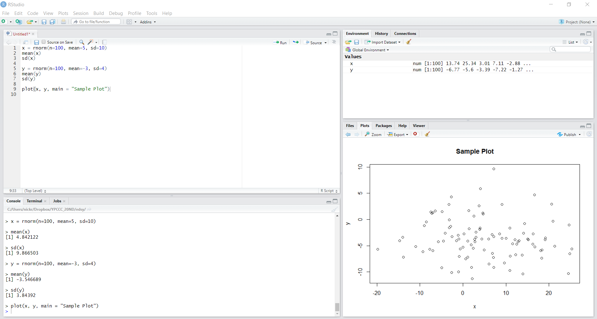
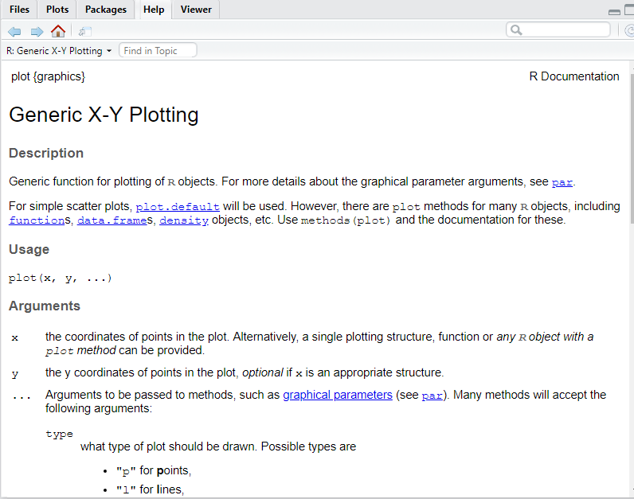

# Orientation {#orientation}

If you have never used R-Studio before, this is the page to start on. We will explain the environment, interface, and tools that make R one of the best platforms for data analysis. If you already have some familiarity with the software or have run programs in R before, feel free to skip this page and instead find the tab with content that answers the specific questions pertaining to your current project.

The goal of our resource pages is to provide an introduction to a few key elements of R in the context of data cleaning, visualization, and analysis. Step by step we will provide the reader with a set of tools that allow for introductory to intermediate R usage, providing resources along the way for those interested to dive deeper.

## Downloading R-Studio

R is a community sourced, public, free to use tool. To install R-Studio, simply go to this [website](https://rstudio.com/products/rstudio/download/), select the free RStudio Desktop option, and pick the right option for your computer's operating system. Once the application is downloaded, open it up so that you can explore the tools along with this guide. 

## Your Work Space

To test out a little bit of R, we've provided a snippet of code below, so you can get a sense of what is happening when you create a new file and what the different outputs looks like. To create a new script, go to File -> New File -> R Script, which should open a blank document in the top left panel. Each numbered line represents a new chunk of logic. They can be run one at a time or collectively as a batch. If you cannot see all four panels in roughly equal dimensions, adjust the margins so that they are all visible. Copy and paste the following code into that top left panel, then click Ctrl+Alt+R to run every line of code together.

```{r}
x <- rnorm(n=100, mean=5, sd=10)
mean(x)
sd(x) 

y <- rnorm(n=100, mean=-3, sd=4)
mean(y)  
sd(y)  

plot(x, y, main = "Sample Plot")
```


What we just did was create two vectors, x and y, which were populated with some randomly generated data. After creating each, we looked at the mean and standard deviation. The random numbers were generated from two distinct normal distributions. We then produced a very simple plot to graphically show the data.

Now you should have a frame that looks like the one pictured above. Notice that there are four panels. We will talk through what each of them is used for and what information it provides. The top left panel, where you just put your text, is a representation of the open script that you are working on. This is the place to save any permanent, replicable work that you produce. Much like a Word Document, it is where you keep the final product of your work session. The bottom left window is the Console, which is a temporary workspace scratch pad. Here you can see the lines of code you've run and the output from any command that prompts the computer to print something back to you. You can also use the console to try out other lines of code without saving them into a document, and see the output of your commands. For example, go down to the arrow right now in Console, type 'head(x)', and then hit enter. You'll see the result of this command, the first six entries of the vector 'x' which we just created. 

Every time you open up R, you start what is called a session. Anything typed in the Console is stored locally within the current session, but once you restart R, it will disappear. For this reason, any line of code that you want to have access to every time you open a document should be typed and saved in the document you are working on.

The top right shows your current global environment. This is where all of the variables, values, and dataframes that you've generated can be found. Right now, you should only have only two values shown here, x and y. Each of them is a numerical vector with 100 entries, all generated from the respective normal distributions. We can tell what dimension things are by looking at the index next to the name. When you create a dataframe, it gets added under the 'Data' header instead of the 'Values' header in this window. The only difference is whether the object is one-dimensional or two-dimensional. Finally, the bottom right will show us several different panels, but right now it should be displaying 'Plots'. Here we can see the result of our plot() call, with the x-values on the horizontal axis and the y-values on the vertical axis. If you click on the 'Files' tab, you can see which folder you are currently working in, otherwise known as your Working Directory (we will discuss what this means in greater detail in the next chapter).

For the most part, you'll want to do your work in the top left panel, so that you can save a record of the calculations that you run. The Console should only be used for temporary or exploratory commands that you don't want to keep in the permanent document, such as examinations of data or test calculations. If anything goes wrong or if you want a fresh start because you did something that you don't know how to undo, simply go to Session/Restart R to begin a new session.

## Helpful Tools for Learning More

If you ever encounter a function that you don't know how to use, simply go to the Console and type in '?' followed by the name of the function (ex: ?plot) you want to learn about.



Up will come a helpful blurb describing the purpose the function executes, the usage, and every argument that can be passed to it. 'Arguments' in this context are modifiers that tell R how to execute a specific function. The example we gave was for the plot() function, which is used to plot two sets of data against each other. We gave this function the argument 'main = "Sample Plot"', which told R to produce a main title for the plot and have the text for that title be "Sample Plot". Details about what arguments will be accepted by each function can all be found with this '?' query method.

Additionally, if you are ever having trouble figuring out what the working directory currently is, you can either type 'getwd()' into your Console, or go to the Files tab in the bottom right, click the 'More' key next to the image of the gear, and select 'Go To Working Directory' to see the folder your script is operating out of. Working directories are especially important when reading in files or accessing data off of your computer.

If you ever want to examine a file manually, you can simple call the View() function, which will open up the object as a document in the top left window. This can be useful when looking at the structure of simple datasets or vectors. However, data can often be too large and unwieldy to make an examination like this productive, so you should get comfortable with using summary functions to do this part of your work. Keep in mind that when you have several tabs open, they all will share whatever your current Working Directory is, which can be confusing. If two scripts have names for variables that are identical, this can lead to a plethora of issues, so it is good habit to only be working on one project at a time and to completely restart R before moving on to a different project.