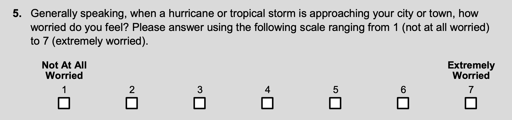

# Structuring {#structuring}

Data structuring is the process of correcting or removing inaccurate records of a "raw data" so that, after the treatment, the transformed data will be easy to analyze and/or consistent with an existing dataset. More explicitly, the variable names, types, and values will be consistent and uniform. The focus here is on the 'appearance' of the data.

## Inspecting the data

In order to structure a dataset, first, we need to be able to detect the anomalies within the data. Types of anomalies include the values that are stored in the wrong format (ex: a number stored as a string), the values that fall outside of the expected range (ex: outliers), values with inconsistent patterns (ex: dates stored as mm/dd/year vs dd/mm/year), trailing spaces in strings (ex: "data" vs "data "), etc.

One method of detecting these anomalies is the summary statistics of the variables, which can be obtained by using `summary()`. Here is an example using the hurricane data:

```{r inspecting-data-1, echo=F, message=F}
library(haven)
data <- read_sav('data/eds.spss.sample.sav')
```


```{r inspecting-data-2, message=F}
# Structure of the data
str(data)
# Summary for a numerical variables
summary(data$Q4)
# Summary for a categorical variable
summary(as_factor(data$Q7))
```

Other ways of exploring the data include:

```{r inspecting-data-3, message=F}
# First 10 rows
head(data, 10)
# Last 10 rows
tail(data, 10)
# Total number of rows
nrow(data)
# Total number of columns
ncol(data)
# Column names
names(data) # also colnames(data)
```

We can also plot the data to visualize the distribution of variables
```{r inspecting-data-4, echo=F, message=F}
library(dplyr)
library(magrittr) # for %>%
data <- data %>% mutate_at(vars(-Q4, -Q6, -Q50), as.factor)
```

```{r inspecting-data-5, out.width='80%'}
# Plotting the first 5 columns
plot(data[,1:5])
```

While these plots could help in understanding the dataset, they could be misleading if the variables are not set to their correct data type.

## Data types

One type of anomaly that we may also encounter is the coercion of irrelevant data types to a variables. This is very common for numerically coded variables or ones that has levels.

For example, if we read in the same SPSS data from the Reading data section, we get the coded values instead of the labels.
```{r data-types-1, echo=FALSE}
data <- tibble::as_tibble(read_sav('data/eds.spss.sample.sav'))
```

```{r data-types-2, message=FALSE, echo=FALSE}
head(data)
```

So if we run `summary(data)` right away then we'll get this unintended result:

```{r data-types-3, echo=FALSE}
summary(data)
```

`Q4` and `Q50` are the only variables that are supposed to be numeric. But here everything is treated as numeric which is incorrect. Also, it is best if we read `Zone` as factor as well so that we find out the possible values.

We can easily convert data types into factor using `dplyr::mutate_at()` and applying `as.factor` function to the variables.

```{r data-types-4, message=FALSE}
# Converting data types
updated_data <- data %>% mutate_at(vars(-Q4, -Q6, -Q50), as_factor)
```

And now we can get the full summary statistics that we want:

```{r data-types-5, echo=FALSE}
summary(updated_data)
```

As we can see from the summary, there might be some anomalies with the variables:

* `Zone`: as most of the respondents are from Zone A. But this is basically related to the survey method which would later require that some weighting of the variables would be applied.
* `Q4: Number of storms experienced`: where the mean value is 2.5 but some response have the value of 20.
* `Q50: Birth year`: where some respondent answered 19 which is incorrect. Also this column is probably better if it's in age instead of birth year.

We can also notice some missing values.

## Subsetting and Filtering

We can remove incorrect or missing row values by using `dplyr::filter`:

```{r filtering-1}
# Removing rows where birth year is irrelevant
# Here we decided that all birth year must be greater 1900
updated_data <- data %>% filter(Q50 > 1900)
# Now if we re-run its summary
summary(updated_data$Q50)
# Removing rows with birth year greater than 1900 and missing responses for Q4
updated_data <- data %>% filter(Q50 > 1900, !is.na(Q4))
summary(updated_data$Q50)
summary(updated_data$Q4)
```

We can also select only the variables that we are interested in using `dplyr::select`:

```{r filtering-2, echo=FALSE}
data$Zone <- factor(data$Zone)
data <- data %>% mutate_at(vars(-Q4, -Q6, -Q50), as_factor)
```

```{r filtering-3}
# Creating a new dataframe with only zone, gender, and income column
updated_data <- data %>% select(Zone, Q59, Q51)
head(updated_data, 10)
plot(table(updated_data), las=1)
```

It is also possible to split the dataset into multiple dataframe by number of rows using `split()`.
```{r filtering-4}
# To split the dataset into multiple dataframe of 10 rows each
max_number_of_rows_per_dataframe <- 10
total_number_rows_in_the_current_dataset <- nrow(data)
sets_of_10rows_dataframes <- split(data, 
                                   rep(1:ceiling(total_number_rows_in_the_current_dataset/max_number_of_rows_per_dataframe), 
                                       each=max_number_of_rows_per_dataframe, 
                                       length.out=total_number_rows_in_the_current_dataset)
                                   )
# Here are the first 2 dataframes
sets_of_10rows_dataframes[[1]] # or sets_of_10rows_dataframes$`1`
sets_of_10rows_dataframes[[2]]
```

## Changing cell values

As we mentionned earlier, it is best if Q50 is stored as an age variable instead of the default birth year. `Q50` is a numeric variable and we can simply change it by using `dplyr::mutate()`

```{r cell-values-1, echo=F}
data <- data %>% filter(Q50 > 1900)
```


```{r cell-values-2}
# Replacing Q50 values to their age in 2020
updated_data <- data %>% mutate(Q50 = 2020 - Q50)
head(updated_data, 10)
# It is also possible to leave Q50 untouched and store the results into a new column
updated_data <- data %>% mutate(age = 2020 - Q50)
head(updated_data, 10)
summary(updated_data$age)
```

For a categorical variable, we use a different function `dplyr::recode_factor()` or `dplyr::recode()`. We will apply this to `Q5` as we have noticed in the previous section that not all of its values were labelled from SPSS. Here is its summary:

```{r cell-values-3, echo=F}
summary(as_factor(data$Q5))
```

Looking back at the questionnare, here is how it was phrased:



Because the survey itself doesn't have labels, the recoding will be up to the user. Here we chose to remove replace the extreme values with 1 and 7. As mentionned in the documentation: `dplyr::recode()` will preserve the existing order of levels while changing the values, and `dplyr::recode_factor()` will change the order of levels to match the order of replacements.

```{r cell-values-4}
# Recoding Q5
recoded.with.recode <- recode(data$Q5, `Not Worried At All`="1", `Extremely Worried`="7")
summary(recoded.with.recode)
recoded.with.recode_factor <- recode_factor(data$Q5, `Not Worried At All`="1", `Extremely Worried`="7")
summary(recoded.with.recode_factor)
```


We can also change cell values without external libraries like `dplyr` by running the following code:
```{r cell-values-5}
# Add column age where the values are 2020 - Q50
data$age <- 2020 - data$Q50
# Replace Q5 with value "Not Worried At All" to "1"
data$Q5[data$Q5 == "Not Worried At All"] <- 1
```

## Pivoting the dataset

In some cases, we may want to split a column based on values, or merge multiple columns into fewer columns. These process can be done using `tidyr` package. For example, to convert the dataframe into long-format with only `Zone`, `question`, and `value` as columns:


```{r tidyr-pivot-1, message=F}
library(tidyr)
# We have to pivot by variable type
# Pivot longer for factor variables
pivoted.longer <- data %>% 
  select_if(is.factor) %>% 
  pivot_longer(-Zone, names_to = "question", values_to = "value")
pivoted.longer
# Then we can reshape it back to the original
pivoted.wider <- pivoted.longer %>%
  group_by(question) %>% mutate(row = row_number()) %>% 
  pivot_wider(names_from = question, values_from = value) %>% 
  select(-row)
pivoted.wider
```

`tidyr::spread()` and `tidyr::gather()` are the outdated equivalent of `tidyr::pivot_wider()` and `tidyr::pivot_longer()`.

To merge or split columns, we can use `tidyr::unite()` or `tidyr::separate()`. For example, to merge `Q7` and `Q10`:

```{r tidyr-pivot-2}
# Creating a new column with responses from both Q7 and Q10
merged <- data %>% unite("Q7_Q10", Q7:Q10, sep = "__", remove = TRUE, na.rm = FALSE)
merged
# To split it back
merged %>% separate(Q7_Q10, c("Q7", "Q10"), sep = "__", remove = TRUE)
```


