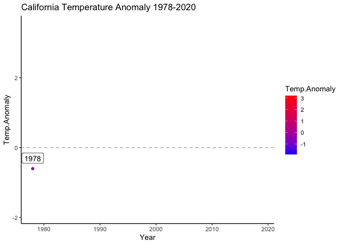
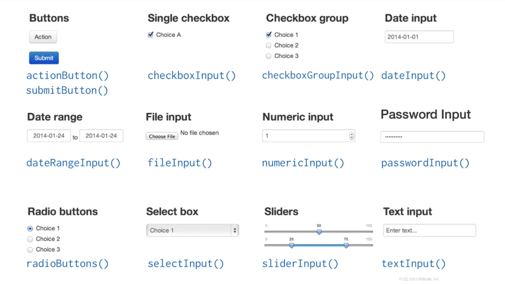

# Visualization

## Simple graphs with `ggplot2`

Reading and recoding data

```{r reading-recoding, message=F, warning=F}
library(haven)
library(ggplot2)
library(tidyr)
library(dplyr)

raw.data <- read_sav('data/ypccc-hurricane.sav')
raw.data <- raw.data %>% filter(raw.data$Q1==1 || raw.data$Q2==1)
raw.data <- raw.data %>% filter(!is.na(raw.data$Q3), raw.data$Q3!=2, raw.data$Q3!=3)

raw.data$S5_cluster <- recode(as.character(raw.data$S5_cluster), '1'='DieHards', '2'='Reluctant', '4'='Optimists', '3'='Constrained', '5'='First Out')
raw.data$S5_cluster <- factor(raw.data$S5_cluster, ordered=T, levels=c('First Out', 'Constrained', 'Optimists', 'Reluctant', 'DieHards'))
data <- raw.data[!is.na(raw.data$S5_cluster),]
```

### Setting `ggplot2` theme

```{r ggtheme}
plot_theme <- 
  theme(
    legend.title = element_blank(),
    legend.box.background = element_rect(),
    legend.box.margin = margin(6, 6, 6, 6),
    legend.background = element_blank(),
    legend.text = element_text(size=12),
    legend.key.size = unit(1, "cm")
  ) + 
  theme(
    axis.text = element_text(size=12, face='bold'),
    axis.line = element_line(size = 1, colour = "#212F3D"),
    axis.title.x = element_blank(),
    axis.title.y = element_blank()
  ) + 
  theme(
    plot.title = element_text(size = 20, face='bold', hjust = 0.5, margin=margin(6,6,6,6)),
    plot.background=element_blank() 
  ) +
  theme(
    panel.grid.major.x = element_blank(),
    panel.grid.minor.x = element_blank(),
    panel.grid.major.y = element_line(size=1)
  )
```

### `ggplot2` Example 1: Stacked bar plot

```{r example-1, warning=F, message=F}
# Q31. Is your home located in a hurricane evacuation zone, or not?
data$Q31 <- as_factor(data$Q31)
data$Q31 <- factor(data$Q31, ordered=T, levels=c('No', 'Not Sure', 'Yes'))

Q31_data <- data %>% 
  select(Q31, S5_cluster, Final_wgt_pop) %>%
  # na.omit() %>%
  group_by(S5_cluster, Q31) %>%
  summarise(Q31.wgt = sum(Final_wgt_pop)) %>%
  mutate(freq.wgt = round(100*Q31.wgt/sum(Q31.wgt))) %>%
  filter(!is.na(Q31))

ggplot(Q31_data, aes(x=S5_cluster, y=freq.wgt, fill=Q31)) +
  geom_bar(aes(fill=Q31), width=.7, stat='identity') +
  geom_text(aes(label=freq.wgt, vjust=.5), position = position_stack(vjust = 0.5), colour='white', size=6, fontface='bold') +
  scale_fill_manual(values=c('#DC7633', '#5D6D7E', '#5499C7'), breaks=c('Yes', 'Not Sure', 'No')) +
  scale_y_continuous(labels = function(x) paste0(x, "%"), expand = c(0, 0), limits = c(0, 100)) +
  labs(title = "% of CT coastal residents who understand\nthat their home is in an evacuation zone") +
  theme(legend.position="top") +
  plot_theme + theme(legend.box.background = element_blank(), legend.spacing.x = unit(.2, 'cm'))
```

### `ggplot2` Example 2: Grouped bar plot

```{r example-2, warning=F, message=F}
# Q23. On a scale of 0%-100%, with 0% being it definitely will NOT happen and 100% being it definitely WILL happen, 
# how likely do you think it is that each of the following types of hurricane will hit somewhere along the 
# Connecticut coast in the next 50 years?

Q23_data <- data %>%
  select(S5_cluster, Q23_1, Q23_2, Q23_3, Q23_4, Final_wgt_pop) %>%
  pivot_longer(-one_of('S5_cluster', 'Final_wgt_pop'), names_to="Category", names_prefix = "Q23_", values_to = "Q23") %>%
  mutate(Category = paste("Category", Category), Q23.wgt = Q23 * Final_wgt_pop) %>%
  na.omit() %>%
  group_by(S5_cluster, Category) %>%
  summarise(freq.wgt = round(sum(Q23.wgt, na.rm=T)/sum(Final_wgt_pop, na.rm=T)))

ggplot(Q23_data, aes(x=S5_cluster, y=freq.wgt, fill=Category)) +
  geom_bar(aes(fill=Category), width=.7, position=position_dodge(.8), stat='identity') +
  geom_text(aes(label=freq.wgt, vjust=1.2), position=position_dodge(.8), colour='white', size=6, fontface='bold') +
  scale_fill_manual(values=c('#F6DDCC', '#EDBB99', '#E59866', '#DC7633')) +
  scale_y_continuous(labels = function(x) paste0(x, "%"), expand = c(0, 0), limits = c(0, 100)) +
  labs(title = "Average perception of each segment that\na Category 1, 2, 3, or 4 hurricane will occur\nin the next 50 years") +
  theme(legend.position="top") +
  plot_theme + 
  theme(legend.box.background = element_blank(), legend.spacing.x = unit(.2, 'cm'))
```

### `ggplot2` Example 3: Scatterplot

```{r example-3, warning=F, message=F}
# Scatterplot of state-level average annual temperature by avg ann precipitation (values and anomalies)
# CAweather <- read.csv('CA_Weather.csv') # missing dataset so go to original source and download manually
# Data source: https://www.ncdc.noaa.gov/cag/statewide/time-series
# Need to set base period from 1978 to 1998 in Options dialog and set parameters before downloading (12-Month)

ca.pcp <- read.csv('data/4-pcp-12-12-1978-2020.csv', skip=4)
ca.tavg <- read.csv('data/4-tavg-12-12-1978-2020.csv', skip=4)
names(ca.pcp) <- c('Year', 'Precip', 'Precip.Anomaly')
names(ca.tavg) <- c('Year', 'Temp', 'Temp.Anomaly')

ca.weather <- left_join(ca.tavg, ca.pcp, by='Year') %>% 
  mutate(Year=as.integer(substr(Year, 1, 4)), 
         Period=if_else(Year<1990, 'Before 1990',
                         if_else(Year<2000, '1990-2000',
                                 if_else(Year<2010, '2000-2010', 'Since 2010')))) %>% 
  mutate(Period=factor(Period, c('Before 1990', '1990-2000', '2000-2010', 'Since 2010')))

s <- ggplot(data = ca.weather, aes(x=Temp.Anomaly, y=Precip.Anomaly))

hottest.v <- max(ca.weather$Temp.Anomaly)
hottest.y <- filter(ca.weather, Temp.Anomaly==hottest.v)$Year
driest.v <- min(ca.weather$Precip.Anomaly)
driest.y <- filter(ca.weather, Precip.Anomaly==driest.v)$Year

s + 
  geom_point(aes(color=Period), size=2) +
  geom_smooth() +
  geom_label(label=if_else(ca.weather$Temp.Anomaly==hottest.v, paste('Hottest Year\n', hottest.y), NULL), nudge_x = -.2, nudge_y = 3) +
  geom_label(label=if_else(ca.weather$Precip.Anomaly==driest.v, paste('Driest Year\n', driest.y), NULL), nudge_x = -.4, nudge_y = 0) +
  labs(title='Hotter and Drier Wildfire Seasons in California', subtitle='Precipitation vs. temperature anomalies in California from January to October over 40 years (1978-2020)', caption='Data from NOAA', y='Precipitation anomaly (inches)', x='Temperature anomaly (°F)') + 
  theme_light() 

# save as png file
# ggsave(file = 'CA.weather.png', height=9, width=12)

# a simpler one
ggplot(ca.weather, aes(Year, Temp.Anomaly)) +
  geom_line(color='#0D47A1') + geom_point(aes(color=Temp.Anomaly)) +
  geom_hline(yintercept=0, linetype=2, color='#aaaaaa') +
  labs(title='California Temperature Anomaly 1978-2020') +
  scale_color_gradient(low='blue', high='red') + 
  theme_classic()
```

## Animated graph with `gganimate`

We can do this by simply adding `gganimate` code to the previous plot.
```{r gganim-1, warning=F, message=F}
library(gganimate)

animated.plot <- ggplot(ca.weather, aes(Year, Temp.Anomaly)) +
  geom_line(color='#0D47A1') +geom_point(aes(color=Temp.Anomaly)) +
  geom_hline(yintercept=0, linetype=2, color='#aaaaaa') +
  labs(title='California Temperature Anomaly 1978-2020') +
  scale_color_gradient(low='blue', high='red') + 
  theme_classic() +
  # labels
  geom_label(aes(label=as.character(Year)), nudge_y=.3) +
  # gganimate code
  transition_reveal(seq_along(Year))

# animate(animated.plot)
```

```{r gganim-2, warning=F, message=F, include=F}
# anim_save('images/gganim.gif', animated.plot)
```



## Interactive graph with `plotly`

Creating an interactive version of the previous graphs is pretty simple using `plotly`. You just have to separate the data by group.

### `plotly` Example 1: Interactive version of the stacked bar

```{r plotly-1, message=F, warning=F}
library(plotly)

Q31.yes <- Q31_data %>% 
  filter(Q31=='Yes')
Q31.notsure <- Q31_data %>% 
  filter(Q31=='Not Sure')
Q31.no <- Q31_data %>% 
  filter(Q31=='No')

plot_ly(x=Q31.yes$S5_cluster, y=Q31.yes$freq.wgt, type='bar', name='Yes', marker = list(color = '#DC7633'), text = Q31.yes$freq.wgt, textposition = 'auto') %>% 
  add_trace(x=Q31.notsure$S5_cluster, y=Q31.notsure$freq.wgt, name='Not Sure', marker = list(color = '#5D6D7E')) %>% 
  add_trace(x=Q31.no$S5_cluster, y=Q31.no$freq.wgt, name='No', marker = list(color = '#5499C7')) %>% 
  layout(barmode = 'stack')
```

You can find more ezamples of using `plotly` on their website: https://plotly.com/r/. 

## Web app with RShiny

_This Shiny tutorial was edited based on the official tutorial on the [website](https://shiny.rstudio.com/tutorial/)_

With RShiny, it is possible to make the functions in your R script available to people who don't necessarily know R. For example, in this [app](https://udwq.shinyapps.io/lakeprofiledashboard/), you can create different types of graph by selecting a site and other parameters. Basically, it's web development using the power of R libraries.

So, just like any web tools, an RshinyApp has components on the User and Server side.


The visual appearance of the app can be modified in the user component. You can use it to change layout, font size, color, etc. Whereas on the server side, you can customize how your app responds to user inputs/interactions.

A basic **ShinyApp starter template** looks like this:
```{r shiny-starter-1, eval=F}
library(shiny)
ui <- fluidPage()
server <- function(input, output){}
shinyApp(ui=ui, server=server)
```
If you run the script above, it will give you and empty page. Some content will show when you add some (text) elements with `fluidPage`.

```{r shiny-starter-2, eval=F}
ui <- fluidPage('Hello world')
server <- function(input, output){}
shinyApp(ui=ui, server=server)
```

### Input functions

For richer content, the `shiny` package has built-in functions that will allow you create them. `sliderInput` for example adds a slider in your web app.

```{r shiny-starter-3, eval=F}
ui <- fluidPage(
  sliderInput(inputId='num',
              label='Choose a number',
              value=25, min=1, max=100)
)
server <- function(input, output){}
shinyApp(ui=ui, server=server)
```

`sliderInput` is part of a group of function called **inputs**. These functions allow an Rshiny developper like yourself to add html element that will serve as user input. Here are some input functions you can try: 


All input functions take as first 2 arguments: `inputId` and `label`. `inputId` is an ID that R will use create the input element in a webpage and to reference it later. `label` is just a text that the user will see, describing what the input element is for. The rest of the arguments are function-specific.

### Output functions

Output functions, on the other hand, allow you to add outputs of R into your web page. As you know, these outputs can be image, plot, table, text, etc. And there are specific output functions for each type of output.


Output functions are called similarly to the input functions:


Here is our app with an output function:
```{r shiny-starter-4, eval=F}
ui <- fluidPage(
  sliderInput(inputId='num',
              label='Choose a number',
              value=25, min=1, max=100),
  plotOutput('hist')
)
server <- function(input, output){}
shinyApp(ui=ui, server=server)
```

Running the previous script won't show any plot though. It just reserve a space in the webpage for plot with id: 'hist'. To actually create the plot, you must use the server function.

### Server function

Server function creates the interactivity in your web application, i.e. this is where you set up how an output (ex: graph) chnages with the user input (ex: some number). However, there are 3 rules that has to be followed and it is summarized in this script:
```{r server-rules, eval=F}
function(input, output){
  #1 outputId is the outputId you defined with output function
  #2 to render on a webpage. To render a plot, use renderPlot()
  output$outputId <- renderSomething({
    #3 inputId is the inputId you defined with input function
    someFunction(input$inputId)
  })
}
# Anything inside the curly braces is an R code. And it can be multiple lines of code.
```

In summary, you must define output variable by the `outputId` and prefixing it with `output$`. You must call the R script that will produce the output with a `render*({})` function. And you must call the user input with its `inputId` and prefixing it with `input$`.

In our example script, we can render it as follow:

```{r shiny-starter-5, eval=F}
ui <- fluidPage(
  sliderInput(inputId='num',
              label='Choose a number',
              value=25, min=1, max=100),
  plotOutput('hist')
)
server <- function(input, output){
    output$hist <- renderPlot({
      title <- paste(input$num, 'random normal values')
      hist(rnorm(input$num), main=title, xlab='values')
  })
}
shinyApp(ui=ui, server=server)
```

To make much more advanced app, simply read the instructions on [Rshiny website](https://shiny.rstudio.com/articles/).

### Sharing your app

Now you can create your own Shiny app. But for now you can only run it in your computer and no one else has access to it. To make available to the public:

1. Save the `ui` and `server` objects/scripts into a stand alone R script, name it `app.R`, and save it in a separate folder. You must name it `app.R` as that's the file that the server will look for when you deploy your app. For this example, I'd save this as `app.R`
```{r shiny-starter-6, eval=F}
ui <- fluidPage(
  sliderInput(inputId='num',
              label='Choose a number',
              value=25, min=1, max=100),
  plotOutput('hist')
)
server <- function(input, output){
    output$hist <- renderPlot({
      title <- paste(input$num, 'random normal values')
      hist(rnorm(input$num), main=title, xlab='values')
  })
}
```
2. Go to [shinyapps.io](https://www.shinyapps.io) and log in or sign for an account.
3. Now simply run the app on your computer
4. In the top right cover of R viewer window, there is a `Publish` button that you can use to publish your app.
5. Simply follow the instructions.

## More dataviz resources

More data visualization resources can be found in this [spreadsheet](https://docs.google.com/spreadsheets/d/156QjpOgLCiDlcmkhJ0RQTVjFYBld8qAhaZsgT7He7b4).
```{r dataviz-list, include=F, eval=F}
## Other data visualization resources
datadrive <- googledrive::drive_get(path = 'https://docs.google.com/spreadsheets/d/156QjpOgLCiDlcmkhJ0RQTVjFYBld8qAhaZsgT7He7b4')
dataviz <- googlesheets4::read_sheet(datadrive, sheet = 'Sheet1')
knitr::kable(dataviz, booktabs=T)
```

