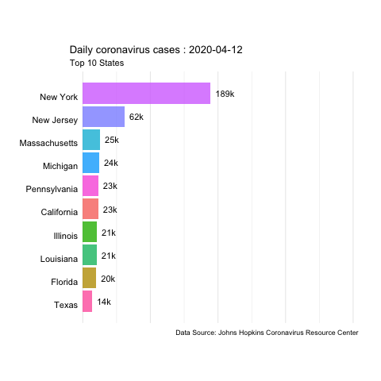

# Analysis {#analysis}

## Working with survey data

For this section, we will use [survey data](https://osf.io/79t2k/) from a study concerning how to approach and engage Christians on the issue of global warming. Using this data will allow us to compare our results from prediction with the original set. In this exercise, we will replicate the application of sampling weights and the standardization of variables which are common treatments of raw survey data, to see how it increases viability of several modelling procedures.

```{r fix-raster-dplyr-conflicts, include=F}
detach('package:raster', unload=TRUE)
```

Our analysis will require a series of packages, several of which we have introduced already in our work up to this point. We will read the data in from a webpage by accessing its URL. In the initial step of our analysis here, we generate a subset of the variables, one for data tagged as 'pre', one for data tagged as 'post', and a third for all other entries. We print out the selected variables using a cat() call, which puts text directly into the Console. 

```{r survey-data-1, echo=F, warning=F, message=F}
# Read in all of the packages we will be using
library(ggplot2)
library(gganimate)
library(haven)
library(stringr)
library(rvest)
library(survey)
library(dplyr)
options(scipen=999)
rm(list=ls())

# Access the data from online
data <- read_sav('https://files.osf.io/v1/resources/79t2k/providers/osfstorage/5c6c390e82a3950018c77ec2?action=download&direct&version=1')

# Getting raw data
data <- data %>% select(-starts_with('Z')) %>% filter(`filter_$`==1)

# Generating subsets of the variables
data.pre <- data %>% select(ends_with('_pre'))
data.post <- data %>% select(ends_with('_post'))
data.others <- data %>% select(-ends_with('_pre'), -ends_with('_post'))
selected.cols <- c(names(data.others)[c(1,2,4,10,11,21,13)], names(data.pre)[1:3], names(data.post)[1:3])
data <- data %>% select(one_of(selected.cols))

# Printing out the selected information
cat('Selected variables')

# Binding together the variables we are going to use
data.variables <- cbind(
  names(data), sapply(data, function(x)attr(x, 'label'))
  ) %>% as_tibble()
data.variables$V2 <- format(data.variables$V2 , justify = "left")
data.variables %>% print()
```

### Variable Standardization

Standardizing variables must be performed before several statistical analyses can be done with the data. Some can be affected by recorded values with different magnitudes of units, and will weight variables with more extreme values higher than those with a smaller range. As such, we start by rescaling the variables using the z-score formula. Standardized variables each have a mean of 0 and a standard deviation of 1. The relational differences in each observation are preserved while the units are simplified and universally standardized.

```{r survey-data-2, warning=F, message=F}
# Z-score formula: Subtract the mean and divide by standard deviation
get.z.score <- function(X){
  (X-mean(X, na.rm=T))/sd(X, na.rm=T)
}

# Standardizing the pretest and posttest variables
Zdata <- data %>% mutate(across(ends_with('_pre')|ends_with('_post'), get.z.score, .names='Z{col}'))
Zdata
```

### Sample weighting

Per Josep Espaga Reig's [book](https://bookdown.org/jespasareig/Book_How_to_weight_a_survey/introduction.html), there are 4 steps in survey weighting:

- Base/design weights: if participants have different probability of being sampled;
- Non-response weights: if some participants didn't respond to the survey;
- Use of auxillary data/calibration: adjusting weights to the total population;
- Analysis of weight variability/trimming: to check variability in the computed weights;

In this example, we will estimate the percent of the US Christian population that believes global warming (GW) is happening and the percentage that are worried about GW. We will give descriptions of the distributions for these two variables and then we will compute the total for the whole US Christian population.

Our variables of interest are:

- **GWHap**: On a scale from 1 to 7, how strongly do you believe that global warming is or is not happening?		
- **GWworry**: How worried are you about global warming?

#### Step 1: Design weights

The [paper](https://www.researchgate.net/publication/334298965) mentions that participants were recruited via Prime Panels. Only those who previously identified as Christians were selected. For the purposes of our analysis, we may assume that each participant had an equal probability of being sampled. Therefore, _we can skip the Step 1 of the weighting_. If we had to compute the design weight $d_i$, it would be equal to the inverse of the probability of being sampled: $1/p_i$. Per Josep Espaga Reig's [book](https://bookdown.org/jespasareig/Book_How_to_weight_a_survey/introduction.html), the design weights can be interepreted as "the number of units in our population that each unit in our sample represents. [...] The sum of all design weights should be equal to the total number of units in our population".

#### Step 2: Non-response weights

The paper describing the methods for the survey does not mention any information about non-respondents during the survey. We can assume that there is no bias in the responses and _we can skip Step 2_. In short, the goal of Step 2 is to account for differences in propensity to respond among the participants. For example, participants from a specific neighborhood, income level, or other key demographic group may have lower response rates, and all the responses we have are from those specific demographic groups, which would bias the analysis.

#### Step 3: Using auxillary data for weight calibration

The goal here is to calibrate the survey data for the population in general. We need information on both the survey respondents and the population they represent. In this case, we will use demographic variables (gender, education, and race). One of the most common methods for calibration weighting is _raking_ which we will use for our example.

As an auxiliary to our original data, we will include the following data from the [PEW Datasets](https://www.pewforum.org/data/). They gives us statistics about the US Christian population. We will scrape these data directly from their website, using the same procedure that we highlighted earlier in our resource page on Extraction.

```{r survey-data-3, warning=F, message=F}
# PEW data
# Accessing only responses from the Christian population and their various weights
pew.data <- read_sav('data/pew-data.sav') %>% 
  select(RELTRAD, agerec, SEX, racethn, WEIGHT) %>% 
  mutate(across(where(is.labelled), as_factor)) %>% 
  mutate(across(where(is.factor), as.character)) %>% 
  mutate(
    religion = RELTRAD %>% recode(
      `Evangelical Protestant Tradition`='christian',
      `Mainline Protestant Tradition`='christian',
      `Historically Black Protestant Tradition`='christian',
      `Catholic`='christian',
      `Mormon`='christian',
      `Orthodox Christian`='christian',
      `Jehovah's Witness`='christian',
      `Other Christian`='christian',
      `Jewish`='other',
      `Muslim`='other',
      `Buddhist`='other',
      `Hindu`='other',
      `Other World Religions`='other',
      `Other Faiths`='other',
      `Unaffiliated (religious "nones")`='other',
      `Don't know/refused - no information on religious identity`='other',
    ),
    pew.age = agerec %>% recode(
      `Age 24 or younger`='18-29',
      `Age 25-29`='18-29',
      `30-34`='30-49',
      `35-39`='30-49',
      `40-44`='30-49',
      `45-49`='30-49',
      `50-54`='50-64',
      `55-59`='50-64',
      `60-64`='50-64',
      `65-69`='65+',
      `70-74`='65+',
      `75-79`='65+',
      `80-84`='65+',
      `85-89`='65+',
      `Age 90 or older`='65+',
      `Don't know/refused`='NA'
    ),
    pew.race = racethn %>% recode(
      `White non-Hispanic`='White',
      `Black non-Hispanic`='Black',
      `Hispanic`='Hispanic',
      `Other`='Other',
      `Don’t know/Refused (VOL.)`='NA'
    )
  ) %>% 
  # Filtering for religion = Christian
  filter(religion=='christian') %>% 
  select(SEX, pew.age, pew.race, WEIGHT) %>% 
  na.omit()

# Renaming the first column to gender
names(pew.data)[1] <- 'pew.gender'

# Printing the first ten rows
head(pew.data,10)

# Generating a frame that is separated by gender and age
pew.gender_age <- pew.data %>% 
  select(pew.age, pew.gender, WEIGHT) %>% 
  group_by(pew.gender, pew.age) %>% summarise(n=sum(WEIGHT)) %>% 
  tidyr::pivot_wider(names_from=pew.age, values_from=n) %>% 
  select(-`NA`)
pew.race <- pew.data %>% select(pew.race, WEIGHT) %>% 
  group_by(pew.race) %>% summarise(n=sum(WEIGHT)) %>% 
  filter(pew.race!='NA')
```

Now we will recode our age and race variables to match the PEW dataset.

```{r survey-data-4, warning=F, message=F}
# Determining interaction between gender and age
our_data.recoded <- data %>% 
  select(ex_ppage, ex_ppgender, raceCat) %>% 
  mutate(across(where(is.labelled), as_factor)) %>% 
  mutate(
    age_group=cut(ex_ppage %>% as.numeric(), breaks=c(18, 30, 50, 65, 100), right=F)
  ) %>% 
  mutate(across(where(is.factor), as.character)) %>% 
  mutate(
    age_group=age_group %>% recode(
      `[18,30)`='18-29',
      `[30,50)`='30-49',
      `[50,65)`='50-64',
      `[65,100)`='65+'
    ),
    race_cat=raceCat %>% recode(
      `White Non-hispanic`='White',
      `Black Non-hispanic`='Black',
      `Hispanic`='Hispanic',
      `Other Non-hispanic`='Other',
      `Two+ races non-hispanic`='Other'
    )
  ) %>% 
  tidyr::unite(col=gender_age, ex_ppgender, age_group, remove=F) %>% 
  mutate(gender_age=replace(x=gender_age, list=gender_age %in% c('Female_NA', 'Male_NA'), values=NA)) %>% 
  na.omit()

# Number of participants/weights by units
# This gives the sum of the final weights from Step 1 and 2 where they were necessary
our_data.gender_age <- our_data.recoded %>% 
  group_by(age_group, ex_ppgender) %>%
  summarise(n = n()) %>% 
  tidyr::pivot_wider(names_from=age_group, values_from=n)
our_data.race <- our_data.recoded %>% 
  group_by(race_cat) %>%
  summarise(n = n())
rm(list=setdiff(ls(), c('data', 'data.variables', 'Zdata', 'pew.data', 'pew.gender_age', 'pew.race', 'our_data.recoded', 'our_data.gender_age', 'our_data.race')))
```

Finally, we will scale the PEW data to our sample size.

```{r survey-data-5, warning=F, message=F}
# Our total (weighted) observations
our_data.wgt <- nrow(our_data.recoded)

# Scaling PEW to our data for age and gender
pew.gender_age.scaled <- pew.gender_age %>%
  tidyr::pivot_longer(-pew.gender, names_to='pew.age', values_to='WEIGHT') %>%
  tidyr::unite(col=gender_age, pew.gender, pew.age)
total.pew <- pew.gender_age.scaled$WEIGHT %>% sum()
pew.gender_age.scaled %<>%
  mutate(Freq = round(WEIGHT/total.pew * our_data.wgt, 0) ) %>%
  select(-WEIGHT)
pew.gender_age.scaled

# Now for race
pew.race.scaled <- pew.race %>%
  mutate(
    Freq = round(n/total.pew * our_data.wgt, 0),
    race_cat=pew.race
  ) %>%
  select(-n, -pew.race)
pew.race.scaled
```

**Implementing calibration**
We will use the same procedure explained in this [book](https://bookdown.org/jespasareig/Book_How_to_weight_a_survey/calibration.html) which employs the `survey` package.

```{r survey-data-6, warning=F, message=F}
# No weights or probabilities supplied, assuming equal probability
our.svydesign <- svydesign(ids = ~ 0, data=our_data.recoded)

# Variables used for calibration are gender/age interaction term and race
our.raked <- rake(our.svydesign, sample.margins = list(~race_cat, ~gender_age), population = list(pew.race.scaled, pew.gender_age.scaled))

# Collecting the weights
raked.weight <- our.raked$postStrata[[1]][[1]] %>% attributes() %>% .[["weights"]]
weighted_data <- our_data.recoded
weighted_data$raked.weight <- raked.weight

# Printing the first ten rows
head(weighted_data, 10)
```

Then, with the weights collected, we scrape the data from the PEW website

```{r survey-data-7, include=F}
# Scraping data from PEW
url = 'https://www.pewforum.org/religious-landscape-study/christians/christian/'
pew.page <- read_html(url)
get_pew_table <- function(page, table_i){
  header <- html_text(html_nodes(page, "table.highchart thead.right-aligned")[table_i])
  content <- html_text(html_nodes(page, "table.highchart tbody")[table_i])
  h.rm.t <- gsub('\\t+',';',header); h <- strsplit(gsub('\\n+','',h.rm.t), ';')[[1]]
  c.rm.t <- gsub('\\t+',';',content); c <- strsplit(gsub('\\n+','',c.rm.t), ';')[[1]]
  hl <- length(h); cl <- length(c); r <- cl/hl;
  c.split <- split(c, rep(1:r, rep(hl, r)))
  pew.table <- as_tibble(do.call(rbind, c.split)); names(pew.table) <- h
  pew.table <- pew.table %>% mutate_all(funs(str_replace_all(.,'%|,',''))) %>% 
    mutate_all(as.integer) %>% mutate_all(funs(.*.01*320e6*.706))
  return(pew.table)
}
```

## Working with COVID-19 data

In this example, we will use daily updated data from the [JHU Covid Resource Center](https://coronavirus.jhu.edu/data) to create an animated time series of coronavirus cases and deaths in the US. For more information on the development of an animated plot, see our Visualization page.

The data are available in [their GitHub repository](https://github.com/CSSEGISandData/COVID-19/tree/master/csse_covid_19_data). We will use the daily report for the US from 04-12-2020 to 06-22-2020. To access all of the files within a repository, we use the list() function, which generates a list of all file names.

```{r covid-1, message=F, warning=F}
# Save the URL to the repository on Github
repo.url <- 'https://raw.githubusercontent.com/CSSEGISandData/COVID-19/master/csse_covid_19_data/csse_covid_19_daily_reports_us/'

# Importing all csv files
us.covid.files <- list()

# Deal with the dated information
date.format <- '%m-%d-%Y'
dates <- format(seq(as.Date('2020/04/12'), as.Date(as.Date('2020/06/22')), by='day'), date.format)
i <- 1

# Cycle through each date, read the csv file, and select the relevant columns
for (date in dates){
  us.covid.files[[i]] <- read.csv(url(paste0(repo.url, date, '.csv'))) %>% 
    select(Province_State, Confirmed, Deaths, Recovered, Mortality_Rate) %>% 
    mutate(Date=as.Date(date, date.format), Confirmed.rank=rank(-Confirmed),
           Deaths.rank=rank(-Deaths), Mortality.rank=rank(-Mortality_Rate))
  i <- i+1
}

# Print the first six rows
head(us.covid.files[[1]])

# Row bind all of the Covid files
us.covid.df <- do.call(rbind, us.covid.files)
```

This next block of code takes the masterfile of all of the selected Covid data and produces an animated plot.

```{r covid-2, message=F, warning=F}
# Line series by state
last.df <- us.covid.files[[length(us.covid.files)]]
us.covid.plot <- ggplot(us.covid.df %>% filter(Confirmed.rank <=10), 
                        aes(y=Confirmed.rank, group=Province_State, fill=Province_State)) +
  geom_tile(aes(x=Confirmed/2, width=Confirmed, height=0.9), alpha=0.8, color=NA) +
  geom_text(aes(x=0, label=paste(Province_State, ' ')), hjust=1, vjust=1) +
  geom_text(aes(x=Confirmed, label=paste0('  ', round(Confirmed/1000), 'k')), hjust=0) +
  scale_y_reverse() + coord_cartesian(clip='off') + 
  theme_bw() +
  # Create a custom ggtheme
  theme(legend.position='none', axis.line=element_blank(), 
        axis.title=element_blank(), axis.ticks=element_blank(),
        axis.text=element_blank(), panel.grid.major.y=element_blank(),
        panel.grid.minor.y=element_blank(), panel.border=element_blank(),
        plot.margin = margin(2,1,2,3,'cm'))
  
us.covid.anim <- us.covid.plot + transition_states(Date, transition_length=4, state_length=1) +
  view_follow(fixed_x=T)  +
  labs(title = 'Daily coronavirus cases : {closest_state}',  
       subtitle  =  'Top 10 States',
       caption  ='Data Source: Johns Hopkins Coronavirus Resource Center')
# animate(us.covid.anim, nframes=400, fps=10, renderer=gifski_renderer('images/us-covid-rank.gif'))
```



The previous animated plot shows the the evolution of the number of cases. If we wanted to produce an animated plot for other variables such as `Mortality_Rate` or `Deaths`, we would follow the same steps.

If instead we want to show how the evolution of cases changes across space, we can use a mapping tool instead.

```{r covid-3, message=F, warning=F}
library(sf)
# Join data with a geometry feature of the US
us.states.geo <- read_sf('data/us-states/us-states.shp')
# Add in the geometry
us.covid.sf <- us.states.geo %>% right_join(us.covid.df, by=c('state_name'='Province_State'))
```

```{r covid-4, message=F, warning=F}
# Mapping
max_val <- max(us.covid.df$Mortality_Rate)
mid_val <- mean(us.covid.df$Mortality_Rate)
map <- ggplot(us.covid.sf) +
  geom_sf(aes(fill=Mortality_Rate), size=.1) +
  scale_fill_gradient2(high='#6E2C00', mid='#FDFEFE', low='#28B463', midpoint=mid_val, limits = c(0,max_val)) + 
  coord_sf(crs=5070) + theme_bw() +
  # Customize our ggtheme
  theme(legend.position='bottom', axis.line=element_blank(),
        axis.title=element_blank(), axis.ticks=element_blank(),
        axis.text=element_blank(), panel.grid.major.y=element_blank(),
        panel.grid.minor.y=element_blank(), panel.border=element_blank(),
        plot.margin = margin(1,1,1,1,'cm'))
map.anim <- map + transition_states(Date, transition_length=4, state_length=1) +
  labs(title = 'Daily coronavirus cases : {closest_state}',
       caption  ='Data Source: Johns Hopkins Coronavirus Resource Center')
# animate(map.anim, nframes=100, fps=5, renderer=gifski_renderer('images/us-covid-map.gif'))
```


