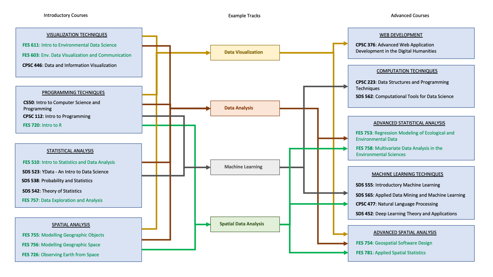

# Resources {#resources}

## Data

Here is a non-exhaustive list of data resources for environmental studies.

```{r data-resources, echo=F}
library(dplyr)
data <- read.csv('data/data-resources.csv') %>% 
  arrange(desc(Region))
knitr::kable(
  data, booktabs=T
)
```

## EDS Course Map

Here are the suggested courses at Yale and tracks to improve your data science skills.


